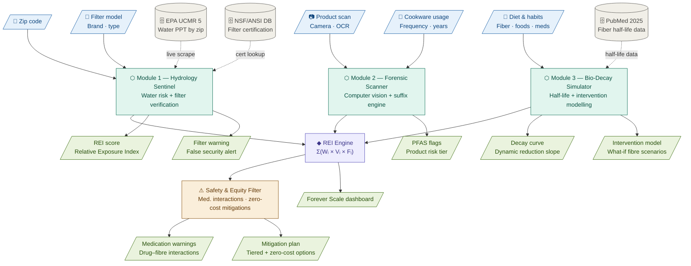

# BioBound Team A: Environment & Experience (The Shell)
**Focus:** User Interface, Geographic Risk Integration, and Policy Advocacy.

## 📅 Phase 1: Foundation (Hours 0-4)
* **Next.js Setup:** Initialize with Tailwind CSS and Lucide-React. 
* **Global State:** Set up a central store (Zustand or React Context) to manage:
    * `zipCode` (String)
    * `waterRisk` (Object: {ppt: number, status: string})
    * `scannerResults` (Object)
* **The Gauge:** Build the "Forever Scale" SVG component (0-100) with dynamic color shifting (Green to Red).

## 📅 Phase 2: The Hydrology Engine (Hours 4-12)
* **Data Ingestion:** Process the [EPA UCMR 5](https://www.epa.gov/dwucmr/fifth-unregulated-contaminant-monitoring-rule-data-finder) dataset.
* **Logic:** Create `calculateWaterScore()`.
    * **Input:** `zipCode` + `filterType`.
    * **Rule:** If `filterType` is NOT NSF-53/58 Certified, the score remains the raw EPA value for that district.
* **UI:** Build the Zip Code landing page and the "Filter Auditor" selection tool.

## 📅 Phase 3: Social Impact & UX Polish (Hours 12-24)
* **The Advocacy Tool:** Build an automated letter generator using string templates to draft emails to local representatives based on the user's specific PFAS levels.
* **The "Cheap Hacks" Library:** Design a "Low-Cost Mitigation" section featuring dust-reduction tips and budget-friendly product swaps.
* **Final Integration:** Link frontend triggers to Team B’s API endpoints and handle loading skeletons.

---

# BioBound Team B: Forensic & Biological (The Engine)
**Focus:** Computer Vision, Chemical Analysis, and Biological Modeling.

## 📅 Phase 1: The Scanner Pipeline (Hours 0-6)
* **OCR Integration:** Implement **Google Cloud Vision API** or a Tesseract-based wrapper.
* **Image Handling:** Build an API endpoint (`/process-image`) that accepts Base64 strings and returns raw strings.
* **Contextual Awareness:** Use Vision API labels to detect product "shapes" (e.g., "popcorn bag," "frying pan") to assign a baseline risk even if text is unreadable.

## 📅 Phase 2: The Suffix Engine (Hours 6-12)
* **Regex Logic:** Build `pfas_hunter.py` to identify hidden chemicals.
    * **Patterns:** `(per|poly)fluoro.*`, `sulfon.*`, `.*fluorotelomer`, `.*phosphate`, `PTFE`.
* **Trade Name Map:** Create a JSON dictionary mapping terms like *Teflon, Gore-Tex, and Scotchgard* to specific PFAS risk multipliers.
* **REI Calculation:** Implement the $REI = \sum (W \times V \times F)$ formula based on user frequency data.

## 📅 Phase 3: The Bio-Simulator (Hours 12-24)
* **Decay Math:** Implement the 8-year biological half-life formula: $C(t) = C_0 e^{-kt}$.
* **Fiber-Acceleration Logic:** Add the variable for the March 2025 Psyllium study. If `dietaryIntervention == true`, apply a 20% acceleration to the decay constant $k$.
* **Safety Logic:** Implement the "Medication Interaction Gate" to ensure health warnings are returned in the JSON response if fiber interventions are suggested.

---

## 🛰️ The API Handshake (Internal Contract)
Team B's `/analyze` endpoint MUST return this structure to Team A:

```json
{
  "product_name": "String",
  "detected_chemicals": ["List", "of", "Strings"],
  "risk_score": 0-100,
  "confidence_interval": 0.0-1.0,
  "decay_data": [
    {"year": 2026, "level": 100},
    {"year": 2030, "level": 70},
    {"year": 2034, "level": 50}
  ],
  "medical_warnings": ["String"]
}
```

## System Architecture

